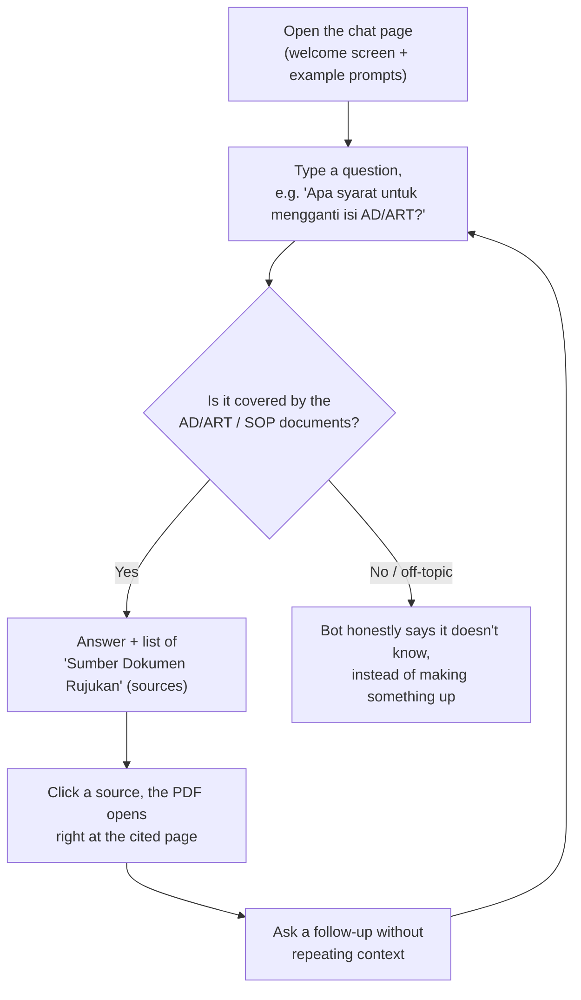
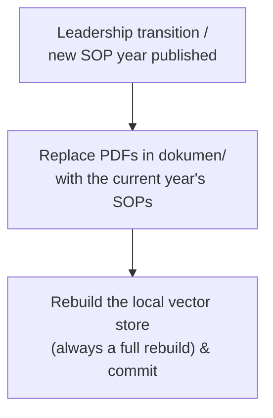
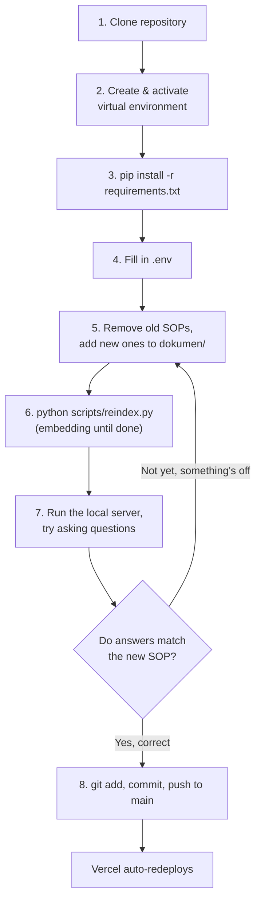
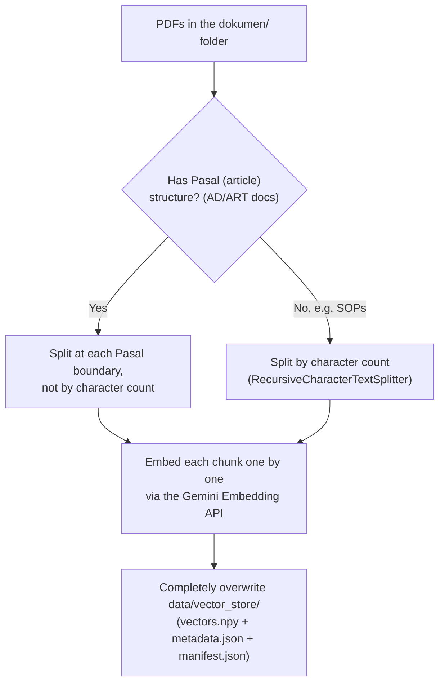
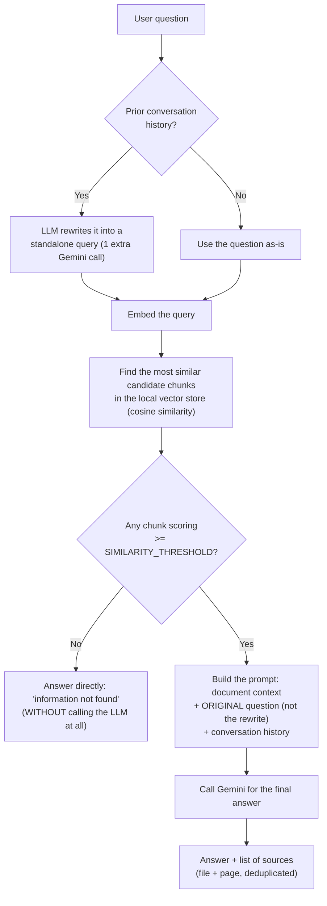

# OSUI Mahawaditra Chatbot

A Retrieval-Augmented Generation (RAG) chatbot that lets members of **OSUI Mahawaditra** (Orkes Simfoni Universitas Indonesia) ask questions about the organization's **AD/ART** (bylaws) and divisional **SOPs**, and get answers grounded in and cited to the actual documents. Indonesian is the default language, but the bot can reply in other languages too if you ask that way.

## Why this exists

AD/ART and SOP documents are long and dense. In practice, members (and even committee holders) forget specific clauses all the time: what the quorum for an extraordinary general meeting is, how a reimbursement request is supposed to be filed, what the fine is for a late due payment, and so on. Digging through a 20-page bylaws PDF every time is friction nobody wants.

This chatbot exists so members can just ask, in natural language, and get an answer sourced directly from the real document, with a link straight to the page it came from, so they can verify it themselves.

For this to stay useful year after year, though, it depends on the SOPs it answers from actually being current: if the source documents are outdated, the answers will be too. Whoever is currently leading the organization is responsible for updating them whenever a new SOP is published, see [Annual SOP update (leadership transition)](#annual-sop-update-leadership-transition) for the full walkthrough.

This is also the author's first hands-on project exploring RAG. Some of the retrieval design (see [How it works](#how-it-works)) reflects lessons learned by hitting real issues with a small, low-resource setup (free-tier LLM + vector DB) rather than a from-the-start "correct" architecture (noted here in case it's useful context for anyone reading the code).

## Table of contents

- [Why this exists](#why-this-exists)
- [Features](#features)
- [User flow](#user-flow)
- **[Annual SOP update (leadership transition)](#annual-sop-update-leadership-transition)**
- [Organization accounts](#organization-accounts)
- [Tech stack](#tech-stack)
- [How it works](#how-it-works)
- [API endpoints](#api-endpoints)
- [Deployment](#deployment)
- [Known limitations](#known-limitations)

## Features

- **Grounded Q&A, Indonesian by default**: answers come only from the actual AD/ART and SOP content; if it's not in the documents, the bot says so instead of guessing.
- **Cited, clickable sources**: every answer lists the source file(s) and page(s) it was drawn from. Clicking a source opens the PDF in-app and jumps straight to that page.
- **Context-aware follow-ups**: short follow-up questions ("terus kalau resign gimana?") are automatically rewritten into standalone queries using the conversation history, so retrieval quality doesn't degrade in multi-turn conversations.
- **Admin-triggered reindexing**: whenever documents change, an admin can rebuild the entire searchable index.

## User flow

**Member:**



**Admin (on every leadership transition):**



Full walkthrough at [Annual SOP update (leadership transition)](#annual-sop-update-leadership-transition). Full rebuild means there's no partial update, see [Known limitations](#known-limitations).

## Annual SOP update (leadership transition)

> **For new admins**: this section is a complete guide, from scratch: from cloning the repo to redeploying with the latest SOPs. Follow it top to bottom, no need to read anything else first.

### Prerequisites
- Python 3.11+
- Git

Here's the flow in short:



### 1. Clone repository

```bash
git clone https://github.com/mahawaditra/ChatbotOSUI.git
cd ChatbotOSUI
```

### 2. Create & activate a virtual environment

A virtual environment (`venv`) isn't technically required, but is strongly recommended so this project's package versions don't clash with other Python projects on your device. The `.venv/` folder is deliberately not cloned from git (it's in `.gitignore`), so it needs to be created fresh on whichever device you're working on:

**Windows (PowerShell):**
```powershell
python -m venv .venv
.\.venv\Scripts\Activate.ps1
```

> If you get a "running scripts is disabled on this system" error when running `Activate.ps1`, that means PowerShell's execution policy is blocking it. The easiest fix: skip activation, and in every Python/uvicorn command below, call `.\.venv\Scripts\python.exe` directly instead of plain `python`/`uvicorn`. This guarantees you're always using the right packages from `.venv`, regardless of execution policy or PATH.

**macOS / Linux:**
```bash
python3 -m venv .venv
source .venv/bin/activate
```

### 3. Install dependencies

Once the venv is active (or swap `pip` for `.\.venv\Scripts\pip.exe` if it isn't activated):

```bash
pip install -r requirements.txt
```

### 4. Fill in `.env`

```bash
cp .env.example .env
```

| Variable                   | Required | Description                                                    |
| -------------------------- | -------- | -------------------------------------------------------------- |
| `GEMINI_API_KEY`           | Yes      | Google AI Studio API key — see [Organization accounts](#organization-accounts) |
| `UPSTASH_REDIS_REST_URL`   | Yes      | Upstash Redis REST endpoint — see [Organization accounts](#organization-accounts) |
| `UPSTASH_REDIS_REST_TOKEN` | Yes      | Upstash Redis REST token — see [Organization accounts](#organization-accounts) |
| `ADMIN_KEY`                | Yes      | Generate your own, don't reuse a previous admin's, see below   |

Generate a secure `ADMIN_KEY`:

```bash
python -c "import secrets; print(secrets.token_hex(32))"
```

> Actual credential values are **not stored in this repo** — see [Organization accounts](#organization-accounts) for where to find them.

### 5. Replace SOP documents

- Document files live in the **`dokumen/`** folder, one PDF per division/document (e.g. `SOP-Divisi-Acara-2026.pdf`, `ADART-OSUIMahawaditra-2022.pdf`).
- **Remove** last year's superseded SOP files from `dokumen/` (if you don't, the chatbot may still cite outdated SOPs, since every PDF in this folder gets indexed).
- **Add** the new SOP PDF files to the same `dokumen/` folder. Follow the existing naming pattern (`SOP-Divisi-<Name>-<Year>.pdf`); this filename appears verbatim as the citation source in the chatbot's answers, so keep it descriptive.
- You **don't need** to manually clear `data/vector_store/`. The reindex step below automatically overwrites the old contents entirely, there's no separate "clear vector db" command.

### 6. Run the reindex (embedding until done)

```bash
python scripts/reindex.py
```
Or if the venv isn't activated (Windows): `.\.venv\Scripts\python.exe scripts\reindex.py`

This reprocesses **ALL** PDFs currently in `dokumen/`: embedding each text chunk one at a time via Gemini, then rewriting `data/vector_store/vectors.npy` + `metadata.json` + `manifest.json` from scratch. For ~10 documents this usually takes a few minutes. A successful run looks like:
```
Memulai reindex...
Selesai. Total chunk ter-index: 246
File diproses: ADART-OSUIMahawaditra-2022.pdf, SOP-Divisi-Acara-2026.pdf, ...
```
Make sure the `File diproses` (files processed) list above matches the new contents of `dokumen/` (no leftover SOPs that should've been removed).

### 7. Run the local server & test before pushing

Don't push without testing first.

**Windows (PowerShell):**
```powershell
uvicorn app.main:app --reload --port 8080
```

Or if the venv **isn't activated (Windows)**: 
```
.\.venv\Scripts\python -m uvicorn app.main:app --reload --port 8080
```

**macOS / Linux (venv already active):**
```bash
uvicorn app.main:app --reload --port 8080
```

Open `http://localhost:8080`, then try asking about a few things that changed in the new SOP (e.g. an article/procedure number that was actually updated this year). Make sure the answer and page citations are correct. If something looks wrong, the most likely cause is step 5 (an old PDF wasn't removed, or the new PDF wasn't indexed yet); fix it and repeat from step 6.

### 8. Push

```bash
git add dokumen/ data/vector_store/
git commit -m "update: SOP tahun <fill in year>"
git push origin main
```
Pushing to `main` automatically triggers a new deploy (see [Deployment](#deployment)). Wait for the build to finish in the Vercel dashboard, then try again on the production URL to confirm.

### Commands you can run

| Command | Function |
|---|---|
| `pip install -r requirements.txt` | Install all Python dependencies |
| `.\.venv\Scripts\python -m uvicorn app.main:app --reload --port 8080` (or `uvicorn app.main:app --reload --port 8080` once the venv is active) | Run the local server (development/testing) |
| `python scripts/reindex.py` | Reprocess **ALL** PDFs in `dokumen/` → embed → **completely overwrite** `data/vector_store/`. This also doubles as "clear the old vector db": there's no separate delete command, since reindexing is always a full rebuild, never incremental |
| `curl -X POST http://localhost:8080/admin/reindex -H "X-Admin-Key: ..."` | Same as `reindex.py`, but over HTTP to a running server. Local dev only, **doesn't work on Vercel** (see [Deployment](#deployment)) |
| `python -c "import secrets; print(secrets.token_hex(32))"` | Generate a secure new `ADMIN_KEY` |

## Organization accounts

This project uses accounts **owned by the organization** (not any individual's personal account) for two external services: Google AI Studio (source of `GEMINI_API_KEY`) and Upstash (source of `UPSTASH_REDIS_REST_URL`/`UPSTASH_REDIS_REST_TOKEN`).

> **Actual login credentials (account email/password, API keys, tokens) are intentionally NOT stored in this repository.** They're shared with current admins via the organization's Google Drive instead, so they can be rotated without needing a new commit, and so access can be revoked for someone who no longer needs it without that history lingering in git forever. If you're a new admin and don't have access to that Drive folder yet, ask the outgoing admin or current org leadership to share it with you.

Whoever currently holds these credentials is responsible for keeping the Drive document up to date whenever a key/token is rotated, and for passing access down at the next leadership transition.

### Gemini API key
- API key dashboard: https://aistudio.google.com/apikey

### Upstash (for the Redis rate-limit token)
- Dashboard: https://console.upstash.com/redis

## Tech stack

| Layer | Choice |
|---|---|
| Backend | [FastAPI](https://fastapi.tiangolo.com/) (Python 3.11+) |
| Frontend | Single-page vanilla HTML/CSS/JS, served directly by FastAPI (no separate frontend framework or build step) |
| LLM (answers) | Google Gemini, via the `google-genai` SDK. Model set by `LLM_MODEL` in `app/config.py` |
| Embeddings | Google Gemini embedding model, called via **raw REST** rather than the SDK (see comments in `app/rag/retrieval.py` / `app/rag/indexing.py`: the SDK's `v1beta` path didn't support the embedding model this project needs). Configured via `EMBEDDING_MODEL` / `EMBEDDING_DIMENSION` in `app/config.py` |
| Vector database | Local: a `numpy` array (`data/vector_store/vectors.npy`) + JSON metadata, committed straight to this git repo. No cloud vector DB account required; see [How it works](#how-it-works) |
| PDF processing | [LangChain](https://python.langchain.com/) (`PyPDFLoader` + `RecursiveCharacterTextSplitter`), plus a custom structure-aware chunker for AD/ART-style documents (see below) |

## How it works

### Indexing: `python scripts/reindex.py` (full rebuild, see [Deployment](#deployment))



Documents that follow a `"Pasal <N>"` article structure (currently the AD/ART) are split along those article boundaries instead of by raw character count, so a single article isn't cut in half mid-sentence. Documents without that structure (the SOPs) fall back to standard character-based chunking. **The entire existing vector store is overwritten every time**: there is no incremental/per-document update, so there's no separate "delete old data" step; reindexing already replaces everything.

### Answering a question: `POST /api/chat`



If there's prior conversation history, the question is first rewritten by the LLM into a standalone query (so "terus kalau resign gimana?" keeps referring to whatever was being discussed); retrieval uses this rewritten query, but the final prompt uses the *original* question so citations/phrasing track what the user actually asked. Retrieval fetches a wider pool of candidates than what's actually needed (see `RETRIEVAL_FETCH_K` in [Known limitations](#known-limitations), a leftover from the old Upstash-based search), filters by a minimum similarity score, and trims to the top few. If nothing relevant survives that filter, the bot returns a refusal message without calling the LLM at all: saves cost/latency and avoids answering from irrelevant context.

## API endpoints

| Method | Path | Description |
|---|---|---|
| `GET` | `/` | Web chat interface |
| `GET` | `/health` | Health check |
| `POST` | `/api/chat` | Ask the chatbot a question |
| `POST` | `/admin/reindex` | Rebuild the entire local vector store (requires `X-Admin-Key` header). Only works when the filesystem is writable (see [Deployment](#deployment)) |

### Example: asking a question

**macOS / Linux / Git Bash:**
```bash
curl -X POST http://localhost:8080/api/chat \
  -H "Content-Type: application/json" \
  -d '{"message": "Berapa masa jabatan ketua?"}'
```

**Windows PowerShell:**
```powershell
curl.exe -X POST http://localhost:8080/api/chat -H "Content-Type: application/json" -d '{\"message\": \"Berapa masa jabatan ketua?\"}'
```

Response:
```json
{
  "answer": "...",
  "sources": [{"file": "ADART-OSUIMahawaditra-2022.pdf", "page": 5}]
}
```

## Deployment

The deployment target has changed a couple of times during development. **The current plan is [Vercel](https://vercel.com/)**, on the free **Hobby** plan. Vercel's native Python/FastAPI support (verified against their docs, not assumed) makes this mostly zero-config, but a few things needed preparing:

- **Entrypoint**: Vercel auto-detects a `FastAPI` instance named `app` at `app/main.py`, which this repo already has. No adapter/shim needed.
- **Runtime version**: pinned via `.python-version` (`3.12`, Vercel's current default) so the deployed runtime doesn't silently drift if Vercel's own default changes later.
- **`vercel.json`** sets `maxDuration` for the `/api/chat` path. It's deliberately *not* stretched to cover a full reindex. Hobby's duration ceiling can't fit that regardless of configuration.
- **Reindexing does not go through the deployed endpoint on Hobby, and can't, at all, once deployed.** Two independent reasons: `/admin/reindex` can take a couple of minutes (chunks are embedded one at a time, with retries), which exceeds Hobby's function time limit no matter how it's configured; and more fundamentally, Vercel's filesystem is **read-only outside `/tmp`**, so even a fast reindex couldn't durably write `data/vector_store/` from a running Vercel instance. Use `scripts/reindex.py` instead: it calls the same `run_indexing()` directly, writing the local vector store to disk without going through Vercel (or any network vector DB) at all:
  ```bash
  python scripts/reindex.py
  ```
  Run it locally whenever `dokumen/` changes (it only needs `GEMINI_API_KEY`), then **commit `data/vector_store/` and redeploy**: the regenerated files ship as part of the deployment bundle. `/admin/reindex` still works for local dev via `uvicorn` (writing straight into your working tree), it's just not usable once deployed.
- **Static & document serving needs no code changes.** Vercel's FastAPI integration auto-promotes `app.mount(..., StaticFiles(...))` directories (`/static`, `/dokumen`) to its CDN while *also* keeping them in the function bundle by default, which is exactly what's needed here, since `run_indexing()` reads `dokumen/*.pdf` from disk at runtime, not just serves it statically. (`dokumen/` is ~3.8MB total, nowhere near Vercel's 500MB bundle limit.) `data/vector_store/` is a plain committed directory read the same way at runtime by `app/rag/vector_store.py`, so it's expected to be included in the bundle the same way. Worth a one-time check against an actual Vercel deploy to confirm.
- **Environment variables** (`GEMINI_API_KEY`, `UPSTASH_REDIS_REST_URL`, `UPSTASH_REDIS_REST_TOKEN`, `ADMIN_KEY`) need to be set in the Vercel project's dashboard (Settings → Environment Variables) or via `vercel env add`. This is account-side and can't be done from a config file in this repo. No vector-DB credentials are needed at all anymore.
- A real bug this surfaced: `app/main.py` used to create `logs/` unconditionally at import time with no error handling. On Vercel's read-only-outside-`/tmp` filesystem that would have crashed the app at cold start, not just silently dropped logging; it's now wrapped in `try/except` so a failure there just disables file-based logging instead. Per-request JSON logs (`logs/*.json`) still won't persist on Vercel either way; regular `logging` calls (already used throughout) show up fine in Vercel's Function Logs regardless.

## Known limitations

- **Indexing is always a full rebuild.** There's no per-document delete/update: every reindex re-processes and re-embeds all PDFs in `dokumen/` and overwrites the entire local vector store.
- **`SIMILARITY_THRESHOLD`** (`app/config.py`) is a starting value, not a calibrated one. If valid answers start getting filtered out (threshold too high) or clearly off-topic questions still get answered (threshold too low), it needs adjusting against real query logs.
- **`RETRIEVAL_FETCH_K` intentionally over-fetches** before trimming down to `TOP_K`. This is a leftover from when retrieval ran against Upstash Vector: Upstash's approximate nearest-neighbor search was found empirically to be unreliable at very small `top_k` values on this corpus (similarity scores across chunks cluster very tightly), occasionally missing the single most relevant chunk entirely when asked for only the top 5. The local vector store does an exact (brute-force) cosine similarity search, so it doesn't have this problem; `RETRIEVAL_FETCH_K` is kept as-is for now rather than bundling a behavior change into the storage migration, but could likely be reduced.
- **Gemini free-tier rate limits apply.** Live chat answers retry once before returning a "please try again" message; indexing retries several times with exponential backoff, but sustained rate limiting will still surface as an error.
