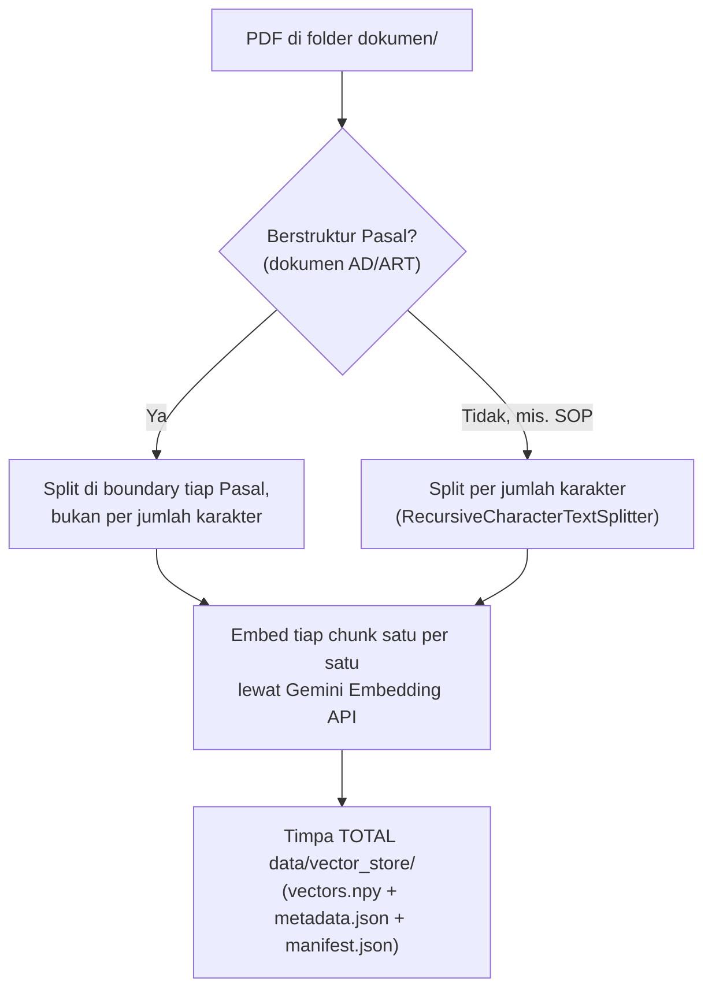
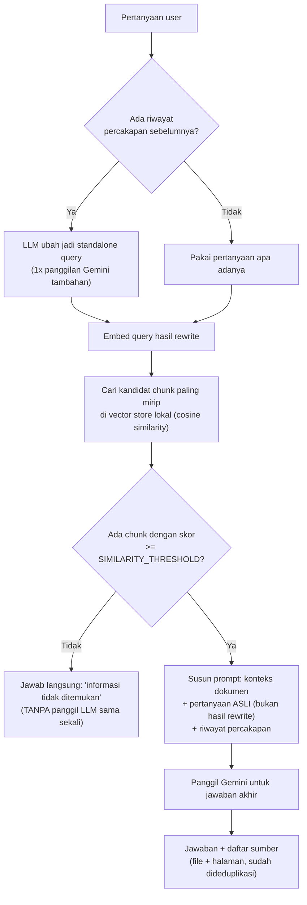
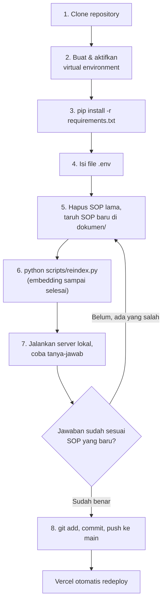

# OSUI Mahawaditra RAG Chatbot

A Retrieval-Augmented Generation (RAG) chatbot that lets members of **OSUI Mahawaditra** (Orkes Simfoni Universitas Indonesia) ask questions in plain Indonesian about the organization's **AD/ART** (bylaws) and divisional **SOPs**, and get answers grounded in and cited to the actual documents.

## Why this exists

AD/ART and SOP documents are long and dense. In practice, members (and even committee holders) forget specific clauses all the time — what the quorum for an extraordinary general meeting is, how a reimbursement request is supposed to be filed, what the fine is for a late due payment, and so on. Digging through a 20-page bylaws PDF every time is friction nobody wants.

This chatbot exists so members can just ask, in natural language, and get an answer sourced directly from the real document — with a link straight to the page it came from, so they can verify it themselves.

This is also the author's first hands-on project exploring RAG. Some of the retrieval design (see [How it works](#how-it-works)) reflects lessons learned by hitting real issues with a small, low-resource setup (free-tier LLM + vector DB) rather than a from-the-start "correct" architecture — noted here in case it's useful context for anyone reading the code.

## Features

- **Grounded Q&A in Indonesian** — answers come only from the actual AD/ART and SOP content; if it's not in the documents, the bot says so instead of guessing.
- **Cited, clickable sources** — every answer lists the source file(s) and page(s) it was drawn from. Clicking a source opens the PDF in-app and jumps straight to that page.
- **Context-aware follow-ups** — short follow-up questions ("terus kalau resign gimana?") are automatically rewritten into standalone queries using the conversation history, so retrieval quality doesn't degrade in multi-turn conversations.
- **Admin-triggered reindexing** — whenever documents change, an admin can rebuild the entire searchable index.

## User flow

**Member:**
1. Open the chat page — a welcome screen with a few suggested prompts is shown.
2. Ask a question in Indonesian, e.g. *"Apa syarat untuk mengganti isi AD/ART?"*.
3. Get an answer plus a **"Sumber Dokumen Rujukan"** (source) list — e.g. *ADART-OSUIMahawaditra-2022.pdf, page 16*.
4. Click a source to open that PDF directly at the cited page, to double-check the wording yourself.
5. Ask a follow-up without repeating context — the app resolves what you mean using the chat so far.
6. If the question is off-topic or genuinely not covered by the documents, the bot says so explicitly rather than making something up.

**Admin (setiap pergantian kepengurusan):**
1. Ganti PDF di `dokumen/` dengan SOP tahun berjalan.
2. Rebuild seluruh vector store lokal (selalu full rebuild — lihat [Known limitations](#known-limitations)) dan commit hasilnya — panduan lengkapnya ada di [Update SOP tahunan (pergantian kepengurusan)](#update-sop-tahunan-pergantian-kepengurusan).

## Tech stack

| Layer | Choice |
|---|---|
| Backend | [FastAPI](https://fastapi.tiangolo.com/) (Python 3.11+) |
| Frontend | Single-page vanilla HTML/CSS/JS, served directly by FastAPI — no separate frontend framework or build step |
| LLM (answers) | Google Gemini, via the `google-genai` SDK. Model set by `LLM_MODEL` in `app/config.py` |
| Embeddings | Google Gemini embedding model, called via **raw REST** rather than the SDK (see comments in `app/rag/retrieval.py` / `app/rag/indexing.py` — the SDK's `v1beta` path didn't support the embedding model this project needs). Configured via `EMBEDDING_MODEL` / `EMBEDDING_DIMENSION` in `app/config.py` |
| Vector database | Local — a `numpy` array (`data/vector_store/vectors.npy`) + JSON metadata, committed straight to this git repo. No cloud vector DB account required; see [How it works](#how-it-works) |
| PDF processing | [LangChain](https://python.langchain.com/) (`PyPDFLoader` + `RecursiveCharacterTextSplitter`), plus a custom structure-aware chunker for AD/ART-style documents (see below) |

## How it works

### Indexing — `python scripts/reindex.py` (full rebuild, see [Deployment](#deployment))



Documents that follow a `"Pasal <N>"` article structure (currently the AD/ART) are split along those article boundaries instead of by raw character count, so a single article isn't cut in half mid-sentence. Documents without that structure (the SOPs) fall back to standard character-based chunking. **The entire existing vector store is overwritten every time** — there is no incremental/per-document update, so there's no separate "delete old data" step; reindexing already replaces everything.

### Answering a question — `POST /api/chat`



If there's prior conversation history, the question is first rewritten by the LLM into a standalone query (so "terus kalau resign gimana?" keeps referring to whatever was being discussed) — retrieval uses this rewritten query, but the final prompt uses the *original* question so citations/phrasing track what the user actually asked. Retrieval fetches a wider pool of candidates than what's actually needed (see `RETRIEVAL_FETCH_K` in [Known limitations](#known-limitations) — a leftover from the old Upstash-based search), filters by a minimum similarity score, and trims to the top few. If nothing relevant survives that filter, the bot returns a refusal message without calling the LLM at all — saves cost/latency and avoids answering from irrelevant context.

## Getting started

Referensi teknis umum untuk development. Kalau tujuanmu spesifik "ganti SOP tahun ini", langsung saja ke [Update SOP tahunan (pergantian kepengurusan)](#update-sop-tahunan-pergantian-kepengurusan) — bagian itu sudah mencakup semua langkah di bawah ini plus langkah spesifiknya.

### Prerequisites
- Python 3.11+
- Your organization's PDF documents placed in `dokumen/`

### 1. Install dependencies
```bash
pip install -r requirements.txt
```

### 2. Configure environment variables

Copy `.env.example` to `.env` and fill in real values:

```bash
cp .env.example .env
```

| Variable | Required | Description |
|---|---|---|
| `GEMINI_API_KEY` | yes | Google AI Studio API key |
| `UPSTASH_REDIS_REST_URL` | yes | Upstash Redis REST endpoint — rate limiting only, unrelated to the vector store |
| `UPSTASH_REDIS_REST_TOKEN` | yes | Upstash Redis REST token |
| `ADMIN_KEY` | yes | Shared secret required by `POST /admin/reindex` |

The local vector store (`data/vector_store/`) needs no credentials at all — it's just files committed to this repo.

Generate a secure `ADMIN_KEY`:
```bash
python -c "import secrets; print(secrets.token_hex(32))"
```

> All required variables are read eagerly at startup (`app/config.py`) — the app fails immediately on launch if any are missing, rather than failing later on a request.

### 3. Run the dev server

**Windows** — kalau kamu belum meng-aktivasi virtual environment di sesi terminal ini, jalankan lewat `python` di dalam `.venv` secara langsung (lebih aman daripada bergantung ke PATH):
```powershell
.\.venv\Scripts\python -m uvicorn app.main:app --reload --port 8080
```
Atau aktivasi dulu venv-nya, baru command `uvicorn` biasa bisa dipakai:
```powershell
.\.venv\Scripts\Activate.ps1
uvicorn app.main:app --reload --port 8080
```

**macOS / Linux:**
```bash
source .venv/bin/activate
uvicorn app.main:app --reload --port 8080
```

Open `http://localhost:8080` in your browser.

### 4. Index your documents (required before first use, and after any document change)

Lihat [Update SOP tahunan (pergantian kepengurusan)](#update-sop-tahunan-pergantian-kepengurusan) untuk penjelasan lengkap — command intinya adalah `python scripts/reindex.py`.

## Update SOP tahunan (pergantian kepengurusan)

> **Untuk pengurus baru**: bagian ini panduan lengkap, dari nol, untuk mengganti dokumen SOP/AD-ART setiap ada pergantian kepengurusan. Ikuti urut dari atas ke bawah — tidak perlu baca bagian lain dulu.

Alur singkatnya seperti ini:



### 1. Clone repository

```bash
git clone https://github.com/mahawaditra/ChatbotOSUI.git
cd ChatbotOSUI
```

### 2. Buat & aktifkan virtual environment

Virtual environment (`venv`) tidak wajib secara teknis, tapi sangat disarankan supaya versi package project ini tidak bentrok dengan Python lain di device kamu. Folder `.venv/` sengaja tidak ikut ter-clone dari git (ada di `.gitignore`), jadi harus dibuat baru di device manapun kamu kerja:

**Windows (PowerShell):**
```powershell
python -m venv .venv
.\.venv\Scripts\Activate.ps1
```
> Kalau muncul error "running scripts is disabled on this system" saat menjalankan `Activate.ps1`, itu artinya PowerShell execution policy memblokirnya. Solusi paling gampang: skip aktivasi, dan di setiap command Python/uvicorn di bawah, panggil langsung `.\.venv\Scripts\python.exe` alih-alih `python`/`uvicorn` biasa — ini menjamin selalu pakai package yang benar dari `.venv`, terlepas dari execution policy atau PATH.

**macOS / Linux:**
```bash
python3 -m venv .venv
source .venv/bin/activate
```

### 3. Install dependencies

Setelah venv aktif (atau ganti `pip` dengan `.\.venv\Scripts\pip.exe` kalau venv tidak diaktivasi):
```bash
pip install -r requirements.txt
```

### 4. Isi file `.env`

```bash
cp .env.example .env
```

Lalu isi `.env` seperti ini:

```env
# Google AI Studio API key (LLM + embedding) — WAJIB diisi.
# Nilai di bawah masih pakai API key akun Google AI Studio milik Adiieeee (pembuat awal chatbot
# ini), tier gratis, jadi boleh langsung dipakai supaya kalian tidak perlu repot bikin akun baru.
# DISARANKAN untuk generate API key sendiri begitu sempat (gratis, ~2 menit, dari akun Google
# pengurus yang sedang menjabat) di https://aistudio.google.com/apikey — lalu ganti nilai ini,
# baik di .env lokal maupun di Environment Variables project Vercel (lihat Deployment).
GEMINI_API_KEY=REDACTED_GEMINI_API_KEY

# Upstash Redis — WAJIB diisi. Dipakai HANYA untuk rate limiting POST /api/chat (bukan buat
# menyimpan dokumen atau vector, itu urusan folder data/vector_store/ yang terpisah total).
# Buat database Redis gratis sendiri di https://console.upstash.com/redis, lalu salin
# "REST URL" dan "REST TOKEN"-nya ke sini.
UPSTASH_REDIS_REST_URL=
UPSTASH_REDIS_REST_TOKEN=

# Secret untuk endpoint POST /admin/reindex — WAJIB diisi, minimal 32 karakter (server akan
# gagal start kalau tidak). Generate sendiri dengan command di bawah, jangan pakai punya orang
# lain/tahun lalu:
# python -c "import secrets; print(secrets.token_hex(32))"
ADMIN_KEY=
```

### 5. Ganti dokumen SOP

- File dokumen ada di folder **`dokumen/`**, satu file PDF per divisi/dokumen (mis. `SOP-Divisi-Acara-2026.pdf`, `ADART-OSUIMahawaditra-2022.pdf`).
- **Hapus** file SOP tahun sebelumnya yang sudah digantikan dari folder `dokumen/` (kalau tidak dihapus, chatbot bisa saja mengutip SOP lama yang sudah tidak berlaku, karena semua PDF di folder ini ikut di-index).
- **Tambahkan** file PDF SOP yang baru ke folder `dokumen/` yang sama. Ikuti pola penamaan yang sudah ada (`SOP-Divisi-<Nama>-<Tahun>.pdf`) — nama file ini yang akan muncul apa adanya sebagai sumber rujukan di jawaban chatbot, jadi usahakan tetap deskriptif.
- Kamu **tidak perlu** menghapus isi `data/vector_store/` secara manual — langkah reindex berikutnya otomatis menimpa total isi lama, tidak ada command "hapus vector db" terpisah.

### 6. Jalankan reindex (embedding sampai selesai)

```bash
python scripts/reindex.py
```
Atau kalau venv tidak diaktivasi (Windows): `.\.venv\Scripts\python.exe scripts\reindex.py`

Ini akan memproses ulang **SEMUA** PDF yang ada di `dokumen/` sekarang — meng-embed tiap potongan teks satu per satu ke Gemini, lalu menulis ulang total `data/vector_store/vectors.npy` + `metadata.json` + `manifest.json`. Untuk ~10 dokumen ini biasanya makan waktu beberapa menit. Output sukses terlihat seperti:
```
Memulai reindex...
Selesai. Total chunk ter-index: 246
File diproses: ADART-OSUIMahawaditra-2022.pdf, SOP-Divisi-Acara-2026.pdf, ...
```
Pastikan daftar `File diproses` di atas sudah sesuai isi `dokumen/` yang baru (tidak ada SOP lama yang harusnya sudah dihapus).

### 7. Tes lewat server lokal SEBELUM push

Jangan langsung push tanpa dicoba dulu — jalankan server lokal:
```powershell
.\.venv\Scripts\python -m uvicorn app.main:app --reload --port 8080
```
Buka `http://localhost:8080`, lalu coba tanya beberapa hal yang isinya berubah di SOP baru (mis. nomor pasal/prosedur yang memang diubah tahun ini). Pastikan jawaban & sumber halamannya benar. Kalau ada yang salah/aneh, kemungkinan besar penyebabnya di langkah 5 (masih ada PDF lama yang belum dihapus, atau PDF baru belum ke-index) — perbaiki lalu ulangi dari langkah 6.

### 8. Push

```bash
git add dokumen/ data/vector_store/
git commit -m "update: SOP tahun <isi tahun>"
git push origin main
```
Kalau repo GitHub ini sudah terhubung ke project Vercel, push ke `main` otomatis memicu deploy baru — lihat [Deployment](#deployment). Tunggu build selesai di dashboard Vercel, lalu coba lagi di URL production untuk memastikan.

### Command yang bisa dipakai

| Command | Fungsi |
|---|---|
| `.\.venv\Scripts\python -m uvicorn app.main:app --reload --port 8080` | Jalankan server lokal (development/testing) |
| `python scripts/reindex.py` | Proses ulang **SEMUA** PDF di `dokumen/` → embed → **timpa total** `data/vector_store/`. Ini sekaligus berfungsi sebagai "hapus isi vector db lama" — tidak ada command hapus terpisah, karena reindex selalu full rebuild, bukan incremental |
| `curl -X POST http://localhost:8080/admin/reindex -H "X-Admin-Key: ..."` | Sama seperti `reindex.py`, tapi lewat HTTP ke server yang sedang jalan. Hanya untuk dev lokal, **tidak bisa dipakai di Vercel** (lihat [Deployment](#deployment)) |
| `pip install -r requirements.txt` | Install semua dependency Python |
| `python -c "import secrets; print(secrets.token_hex(32))"` | Generate `ADMIN_KEY` baru yang aman |

## API endpoints

| Method | Path | Description |
|---|---|---|
| `GET` | `/` | Web chat interface |
| `GET` | `/health` | Health check |
| `POST` | `/api/chat` | Ask the chatbot a question |
| `POST` | `/admin/reindex` | Rebuild the entire local vector store (requires `X-Admin-Key` header). Only works when the filesystem is writable — see [Deployment](#deployment) |

### Example: asking a question

**macOS / Linux / Git Bash:**
```bash
curl -X POST http://localhost:8080/api/chat \
  -H "Content-Type: application/json" \
  -d '{"message": "Berapa masa jabatan ketua?"}'
```

**Windows PowerShell:**
```powershell
curl.exe -X POST http://localhost:8080/api/chat -H "Content-Type: application/json" -d '{\"message\": \"Berapa masa jabatan ketua?\"}'
```

Response:
```json
{
  "answer": "...",
  "sources": [{"file": "ADART-OSUIMahawaditra-2022.pdf", "page": 5}]
}
```

## Deployment

The deployment target has changed a couple of times during development. **The current plan is [Vercel](https://vercel.com/)**, on the free **Hobby** plan. Vercel's native Python/FastAPI support (verified against their docs, not assumed) makes this mostly zero-config, but a few things needed preparing:

- **Entrypoint** — Vercel auto-detects a `FastAPI` instance named `app` at `app/main.py`, which this repo already has. No adapter/shim needed.
- **Runtime version** — pinned via `.python-version` (`3.12`, Vercel's current default) so the deployed runtime doesn't silently drift if Vercel's own default changes later.
- **`vercel.json`** sets `maxDuration` for the `/api/chat` path. It's deliberately *not* stretched to cover a full reindex — Hobby's duration ceiling can't fit that regardless of configuration.
- **Reindexing does not go through the deployed endpoint on Hobby — and can't, at all, once deployed.** Two independent reasons: `/admin/reindex` can take a couple of minutes (chunks are embedded one at a time, with retries), which exceeds Hobby's function time limit no matter how it's configured; and more fundamentally, Vercel's filesystem is **read-only outside `/tmp`**, so even a fast reindex couldn't durably write `data/vector_store/` from a running Vercel instance. Use `scripts/reindex.py` instead — it calls the same `run_indexing()` directly, writing the local vector store to disk without going through Vercel (or any network vector DB) at all:
  ```bash
  python scripts/reindex.py
  ```
  Run it locally whenever `dokumen/` changes (it only needs `GEMINI_API_KEY`), then **commit `data/vector_store/` and redeploy** — the regenerated files ship as part of the deployment bundle. `/admin/reindex` still works for local dev via `uvicorn` (writing straight into your working tree), it's just not usable once deployed.
- **Static & document serving needs no code changes.** Vercel's FastAPI integration auto-promotes `app.mount(..., StaticFiles(...))` directories (`/static`, `/dokumen`) to its CDN while *also* keeping them in the function bundle by default — which is exactly what's needed here, since `run_indexing()` reads `dokumen/*.pdf` from disk at runtime, not just serves it statically. (`dokumen/` is ~3.8MB total, nowhere near Vercel's 500MB bundle limit.) `data/vector_store/` is a plain committed directory read the same way at runtime by `app/rag/vector_store.py`, so it's expected to be included in the bundle the same way — worth a one-time check against an actual Vercel deploy to confirm.
- **Environment variables** (`GEMINI_API_KEY`, `UPSTASH_REDIS_REST_URL`, `UPSTASH_REDIS_REST_TOKEN`, `ADMIN_KEY`) need to be set in the Vercel project's dashboard (Settings → Environment Variables) or via `vercel env add` — this is account-side and can't be done from a config file in this repo. No vector-DB credentials are needed at all anymore.
- A real bug this surfaced: `app/main.py` used to create `logs/` unconditionally at import time with no error handling. On Vercel's read-only-outside-`/tmp` filesystem that would have crashed the app at cold start, not just silently dropped logging — it's now wrapped in `try/except` so a failure there just disables file-based logging instead. Per-request JSON logs (`logs/*.json`) still won't persist on Vercel either way; regular `logging` calls (already used throughout) show up fine in Vercel's Function Logs regardless.

## Known limitations

- **Indexing is always a full rebuild.** There's no per-document delete/update — every reindex re-processes and re-embeds all PDFs in `dokumen/` and overwrites the entire local vector store.
- **`SIMILARITY_THRESHOLD`** (`app/config.py`) is a starting value, not a calibrated one. If valid answers start getting filtered out (threshold too high) or clearly off-topic questions still get answered (threshold too low), it needs adjusting against real query logs.
- **`RETRIEVAL_FETCH_K` intentionally over-fetches** before trimming down to `TOP_K`. This is a leftover from when retrieval ran against Upstash Vector: Upstash's approximate nearest-neighbor search was found empirically to be unreliable at very small `top_k` values on this corpus (similarity scores across chunks cluster very tightly), occasionally missing the single most relevant chunk entirely when asked for only the top 5. The local vector store does an exact (brute-force) cosine similarity search, so it doesn't have this problem — `RETRIEVAL_FETCH_K` is kept as-is for now rather than bundling a behavior change into the storage migration, but could likely be reduced.
- **Gemini free-tier rate limits apply.** Live chat answers retry once before returning a "please try again" message; indexing retries several times with exponential backoff, but sustained rate limiting will still surface as an error.

## No test suite

There's no automated test suite, linter, or type-checker configured in this repo yet.
